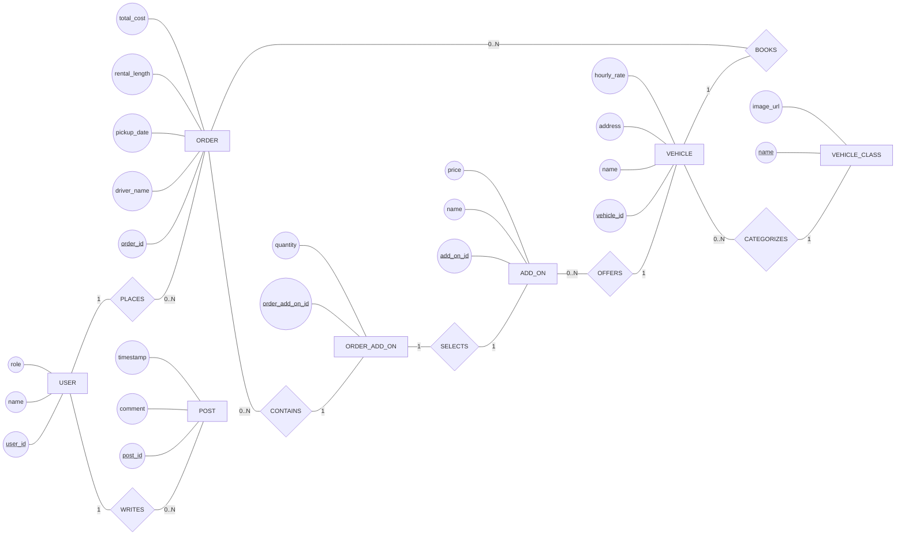

# Echelon App ERD - Chen Notation

## Notes

- `VEHICLE` is the app's current `Restaurant` model.
- `ADD_ON` is the app's current `Item` model.
- `ORDER_ADD_ON` stores selected add-ons and their quantities for each order.
